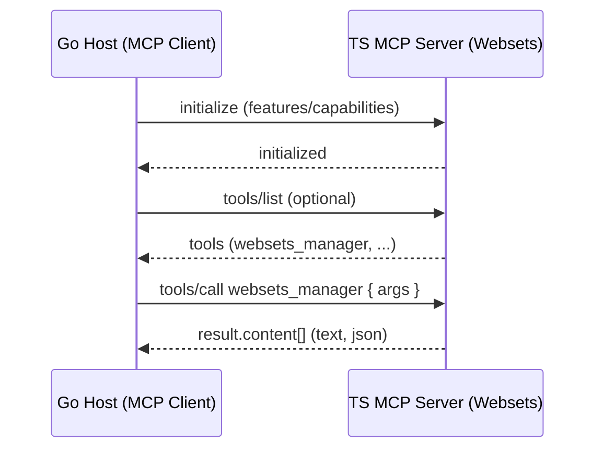
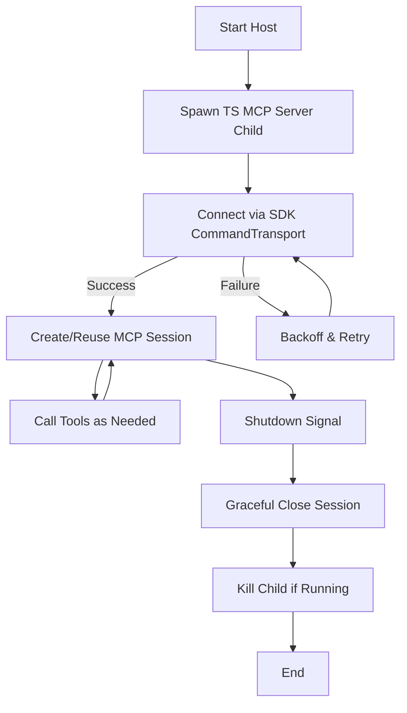
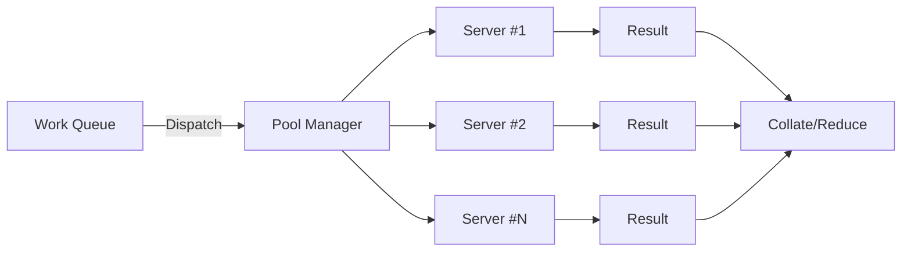
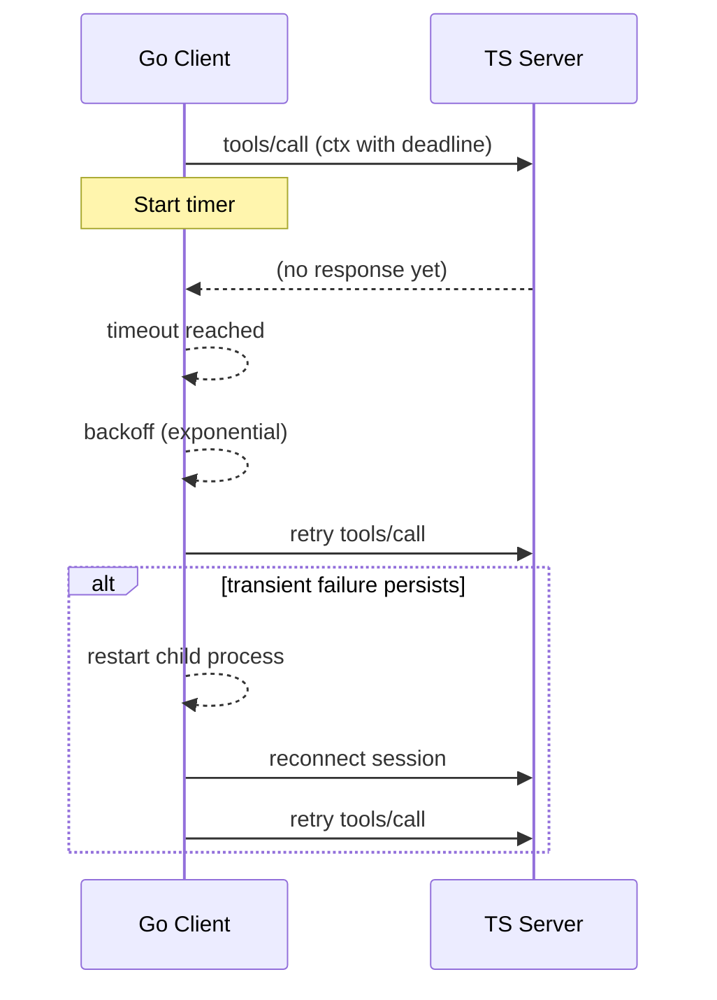

# Subprocess MCP Design Pattern (Go host ↔ TypeScript server)

## Intent
Run a TypeScript MCP server (EXA Websets) as a child process of a Go application, speaking Model Context Protocol over stdio JSON‑RPC. This bridges language boundaries without bindings and adheres to MCP’s standard tool invocation.

### Architecture overview (high level)

```mermaid
graph TD
  A[Go Host Process<br/>MCP Client (SDK)] -- stdio JSON-RPC --> B[TypeScript MCP Server<br/>EXA Websets Tools]
  B --> C[External Services<br/>EXA API, Web, etc.]
  A --> D[Widescreen Orchestrator]
  D --> E[Drone Fleet (HTTP)]
  E --> F[Pub/Sub<br/>Async Results]
  D --> G[Progress + Reports]
```

## Why this pattern
- Keeps the TS code (websets logic, polling, pagination) intact
- Avoids re-implementing APIs in Go
- Uses MCP’s first‑class stdio transport and tools/call semantics
- Swappable server: any MCP server can be dropped in under the same client

## Roles (per MCP spec)
- Host/Client (Go): initiates connection, lists/calls tools
- Server (TS): exposes `websets_manager` and related tools via MCP SDK
- Transport: stdio (stdin/stdout) using JSON‑RPC 2.0 message frames

## Message flow
1) initialize: client → server (capabilities)
2) tools/list (optional sanity)
3) tools/call name=`websets_manager` with arguments
4) result: server → client `result.content[]` (usually first item is text)

### Sequence diagram (protocol)



## Process model
- Go creates a long‑lived child: `exa-websets-mcp-server` (bin) or `node build/index.js`
- Connection established via SDK `NewCommandTransport(exec.Command(...))`
- One session reused across calls; restart on crash
- Graceful shutdown ties to Go process lifecycle

### Lifecycle flow



## Concurrency
- Start serialized calls per server instance
- If needed, scale by creating multiple child processes (pool) and shard calls
- MCP JSON‑RPC supports concurrent IDs, but pool-based scaling simplifies backpressure

### Concurrency options



## Timeouts and retries
- Apply per‑call context deadlines
- Use polling patterns for long operations (e.g., get_webset_status)
- Backoff and retry transient failures; one process restart attempt

### Error handling and retries



## Error surfaces
- JSON‑RPC error → transport/protocol failure
- Tool-level isError: true → business error returned in result.content

## Observability
- Log child start/stop, calls (tool name, duration), and errors
- Optional metrics: per‑operation counters/latency, restart counts

### Observability signals

```mermaid
graph LR
  A[Host Logger] --> L1[Child Start/Stop]
  A --> L2[Tool Calls (name, duration)]
  A --> L3[Errors]
  M[Metrics] --> C1[Per-op Counters]
  M --> C2[Latency Histograms]
  M --> C3[Restart Counts]
```

## Security
- Pass EXA_API_KEY only through child env; never log
- Constrain child binary path and arguments

## Failure modes and handling
- Child exit: mark client unhealthy; next call attempts reconnect
- Stuck child: CallTool context deadline cancels; consider kill/replace
- Tool busy/limits: backoff; reduce concurrency; respect EXA rate limits

## Alternatives considered
- Native Go client to EXA Websets API: single language but re‑implements TS server logic
- HTTP facade on TS server: adds surface area; MCP already solves the contract
- In‑process JS engine: complex and non‑standard for production

## Fit within Widescreen Research
- The orchestrator already owns async orchestration and Pub/Sub; subprocess MCP feeds that pipeline with Websets items
- Minimal edits: implement WebsetsClient, add RunWebsetsPipeline, register operations

## Rollout
1) Add client and wire into orchestrator
2) Integrate new operation(s) in server
3) Local smoke test with a real EXA_API_KEY
4) Stage rollout; monitor restart rates, call success, item throughput


